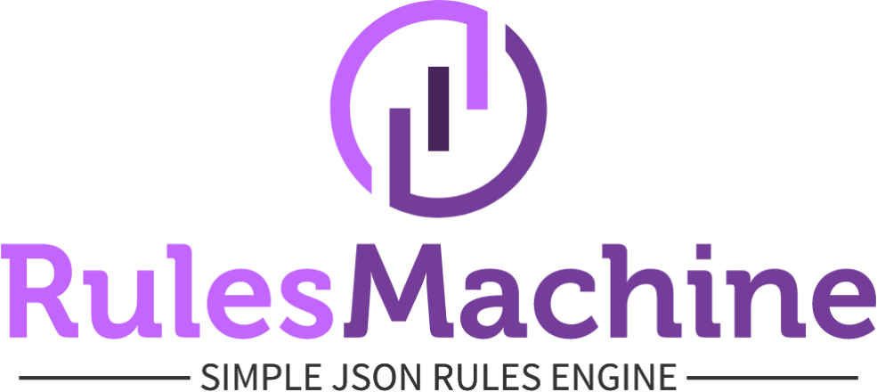

# Rules Machine

<!-- markdownlint-disable MD033 -->
<!-- markdownlint-disable MD036 -->

[](https://github.com/elite-libs/rules-machine/actions)
[](https://www.npmjs.com/package/@elite-libs/rules-machine)
[](https://github.com/elite-libs/rules-machine)



> _Rules Against The Machine_ 🤘

<!-- * One Rules Engine to rule them all.
* With great _Rules_, comes great observability. -->

**Table of Content**

- [Rules Machine](#rules-machine)
  - [What's a `Rules Machine`?](#whats-a-rules-machine)
    - [Goals](#goals)
    - [Key Terms](#key-terms)
    - [Finding Opportunities for Rules](#finding-opportunities-for-rules)
  - [Why Rules Engines?](#why-rules-engines)
    - [Pros](#pros)
    - [Cons](#cons)
  - [Install](#install)
  - [Usage](#usage)
  - [Examples](#examples)
    - [Example Rule: Apply Either $5 or $10 Discount](#example-rule-apply-either-5-or-10-discount)
    - [Example Rule: Apply $15 Discount if Employee, or Premium Customer](#example-rule-apply-15-discount-if-employee-or-premium-customer)
    - [Example Rule: Multiple Conditional, Nested Rules](#example-rule-multiple-conditional-nested-rules)
    - [Example Rule: Use variable between rules](#example-rule-use-variable-between-rules)
  - [All Operators & Functions](#all-operators--functions)
    - [Builtin Operators](#builtin-operators)
    - [Functions](#functions)
      - [Extended Methods](#extended-methods)
      - [Utility Functions](#utility-functions)
      - [Math Functions: Core](#math-functions-core)
      - [Array Functions](#array-functions)
      - [Object Functions](#object-functions)
      - [String Functions](#string-functions)
      - [Math Functions: Advanced](#math-functions-advanced)
  - [More Reading & Related Projects](#more-reading--related-projects)
  - [TODO](#todo)

## What's a `Rules Machine`?

It's a fast, general purpose [`JSON Rules Engine`](https://martinfowler.com/bliki/RulesEngine.html) library for both the Browser & Node.js! 🚀

### Goals

- **Share business logic** - move logic around the I/O layer, just like data.
  - Shared validation logic (same logic from the web form to the backend)
  - Push rules where they are needed: Cloud functions, CloudFlare Workers, Lambda@Edge, etc.)
- **Organize complexity** - isolate complex Business Rules from App Logic and state.
  - Name, group and chain rules.
  - Don't repeat yourself: reference common rule(s) by name. (`applySalesTax`)
- **Modeling workflows** - model your business logic as a series of readable steps.
  - Help non-dev stakeholders (QA, Product) understand critical logic.
  - Simply formatting JSON Rules sheds light on both hierarchy & steps.

<!-- Designed to prioritize simplicity, limited operations, security - no access to runtime (`eval`/`new Func`).

 in one flavor or another, whether you realize it or not. In fact this sort of rough design is built into everything from [GitHub Actions](#reference-gh-actions), [VS Code Keybindings config](https://code.visualstudio.com/docs/getstarted/keybindings#_keyboard-rules), [Ansible Playbooks](https://docs.ansible.com/ansible/latest/user_guide/playbooks_conditionals.html#basic-conditionals-with-when), [Helm templates](https://helm.sh/docs/chart_template_guide/control_structures/), [Datree](https://hub.datree.io/basic-examples#c6-example-1) and so many more. -->

### Key Terms

`App Logic != Business Rules`

- **App Logic** - applies more broadly and changes less frequently than Business Rules.
  - _"Throw Error if ShoppingCart total is less than zero."_
  - _"Only one discount code can be applied at a time."_
  <!-- App Logic is close to Core component behavior. For example, adding a `locale={countryCode}` to the `<Calendar>` component will change it's App Logic. -->
- **Business Rules** - targeted & detailed, can change frequently.
  - Supports business goals & objectives (as they evolve) from Product, Leadership, Legal, Finance, A/B Tuning, etc.
  - _"Premium customers can apply 3 discounts, up to 25% off."_
  - _"If we're in lock-down, double shipping estimates."_
  - _"If State is NY, add NY tax."_
  - _"If State is AZ and during Daylight Savings, offset an hour."_
  <!-- _"Prevent meeting requests on Weekends."_ is more of a Business Rule, because it's specific to a scheduling application, and its current context. -->

### Finding Opportunities for Rules

Typically Business Rules are better-suited to 'rules engine' style pattern.

If your Business Rules or logic changes frequently, you can get alignment benefits by moving that logic to a serializable & sharable format. Specifically, this can provide immediate benefits to mobile & native apps, as you don't have to wait for an approvals process for every change. ✨

<!--
(I know there are other ways to describe this concept. I'm choosing to avoid CS jargon stuffing.)
 -->

## Why Rules Engines?

Typically App Logic & Business Rules are woven together throughout the project. This co-location of logic is usually helpful, keeping things readable in small and even mid-sized projects.

This works great, until you run into one of the following challenges:

1. **Storing Rules**
   - A note taking app could let users create custom shortcuts, where typing "TODO" could load a template.
   - These "shortcuts" (JSON Rules) can be stored in a local file, synced to a database, or even broadcast over a mesh network.
2. **Unavoidable Complexity**
   - In many industries like healthcare, insurance, finance, etc. it's common to find 100's or 1,000s of rules run on every transaction.
   - Over time, "Hand-coded Rules" can distract & obscure from core App Logic.
   - Example: Adding a feature to a `DepositTransaction` controller shouldn't require careful reading of 2,000 lines of custom rules around currency hackery & country-code checks.
   - Without a strategy, code eventually sprawls as logic gets duplicated & placed arbitrarily. Projects become harder to understand, risky to modify, and adding new rules become high-stakes exercises.
3. **Tracing Errors or Miscalculations**
   - Complex pricing, taxes & discount policies can be fully "covered" by unit tests, yet still fail in surprising ways.
   - Determining how a customer's subtotal WAS calculated after the fact can be tedious & time consuming.

<details>

<summary><b>Additional Scenarios & Details</b></summary>

- Example: Sales tax rates and rules are defined by several layers of local government. (Mainly City, County, and State.)
  - Depending on the State rules, you'll need to calculate based on the Billing Address or Shipping Address.
- Scenario: A California customer has expanded into Canada. Their new shipping destination seems to cause double taxation!?!
  - In this situation, a trace of the computations can save hours of dev work, boost Customer Support' confidence issuing a partial refund, and the data team can use the raw data to understand the scope of the issue.
- Scenario: "Why did we approve a $10,000,000 loan for 'The Joker'?"
- Scenario: "How did an Ultra Sports Car ($1M+) qualify for fiscal hardship rates?"

</details>

<!-- Investigating these questions is usually a manual process, with expensive senior developers trudging through 10K-100Ks of lines of code, all to give you an unsatisfying shrug and a mere plausible cause. -->

### Pros

- Uses a subset of JavaScript and structured JSON object(s).
- Easy to start using & experimenting with, larger implementations require more planning.
- Provides a `trace`, with details on each step, what happened, and the time taken.

### Cons

- Sizable projects require up-front planning & design work to properly adapt this pattern. (1,000s rules, for example.)
- Possible early optimization or premature architecture decision.
- Not as easy to write compared to a native language.

## Install

```bash
yarn add @elite-libs/rules-machine
# Or
npm install @elite-libs/rules-machine
```

## Usage

```ts
import { ruleFactory } from '@elite-libs/rules-machine';

const fishRhyme = ruleFactory([
  { if: 'fish == "oneFish"', then: 'fish = "twoFish"' },
  { if: 'fish == "redFish"', then: 'fish = "blueFish"' },
  { return: 'fish' }
]);
// Equivalent to:
// if (fish == "oneFish") fish = "twoFish"
// if (fish == "redFish") fish = "blueFish"

fishRhyme({ fish: 'oneFish' }); // 'twoFish'
```

## Examples

### Example Rule: Apply Either $5 or $10 Discount

```json
// Using "and" object style operator
[
  {"if": {"and": ["price >= 25", "price <= 50"]}, "then": "discount = 5"},
  {"if": "price > 50", "then": "discount = 10"},
  {"return": "discount"}
]
// Using inline AND operator
[
  {"if": "price >= 25 AND price <= 50", "then": "discount = 5"},
  {"if": "price > 50", "then": "discount = 10"},
  {"return": "discount"}
]
```

<details>
<summary>Show YAML</summary>

```yaml
- if: { and: [price >= 25, price <= 50] }
  then: discount = 5
- if: price > 50
  then: discount = 10
- return: discount
```

</details>

### Example Rule: Apply $15 Discount if Employee, or Premium Customer

```json
[
  {
    "if": "user.plan == \"premium\"",
    "then": "discount = 15"
  },
  {
    "if": "user.employee == true",
    "then": "discount = 15"
  },
  {
    "return": "discount"
  }
]
```

### Example Rule: Multiple Conditional, Nested Rules

```json
[
  {
    "if": "price <= 100",
    "then": "discount = 5"
  },
  {
    "if": {
      "or": ["price >= 100", "user.isAdmin == true"]
    },
    "then": "discount = 20"
  },
  {
    "return": "discount"
  }
]
```

<details>
<summary>Show YAML</summary>

```yaml
- if: price <= 100
  then: discount = 5
- if:
    or: [price >= 100, user.isAdmin == true]
  then: discount = 20
- return: discount
```

</details>

### Example Rule: Use variable between rules

```json
[
  {
    "if": "price <= 100",
    "then": ["discount = 5", "user.discountApplied = true"]
  },
  {
    "if": {
      "and": ["price >= 90", "user.discountApplied != true"]
    },
    "then": "discount = 20"
  },
  {
    "return": "discount"
  }
]
```

<details>
<summary>Show YAML</summary>

```yaml
- if: price <= 100
  then:
    - discount = 5
    - user.discountApplied = true
- if:
    and:
      - price >= 90
      - user.discountApplied != true
  then: discount = 20
- return: discount
```

</details>

## All Operators & Functions

### Builtin Operators

1. `!=`
1. `=` - equality check.
1. `==` - equality check.
1. `<`
1. `<=`
1. `<>`
1. `>`
1. `>=`
1. `%` - `10 % 2` => `0` (tip: odd/even check)
1. `*` - `42 * 10` => `420`
1. `+` - `42 + 10` => `52`
1. `-`
1. `/`
1. `^`
1. `~=`
1. `AND`
1. `OR`

### Functions

#### Extended Methods

1. `REMOVE_VALUES(matches, input)` - will remove all values matching the item(s) in the 1st argument from the 2nd argument array. (XOR operation.)
1. `FILTER_VALUES(matches, input)` - will ONLY INCLUDE values that are in the 1st & 2nd arguments. (Intersection operation.)
1. `CONTAINS(42, [41, 42, 43])` => `true`

#### Utility Functions

1. IF() - `IF(7 > 5, 8, 10)` => `8`
1. GET() - `GET('users[2].name', users)` => `Mary`

<!--
1. PUT()
-->

#### Math Functions: Core

1. AVERAGE() - `AVERAGE([10, 20, 30])` => `20`
1. CEIL() - `CEIL(0.1)` => `1`
1. FLOOR() - `FLOOR(1.9)` => `1`
1. ROUND() - `FLOOR(0.6)` => `1`
1. TRUNC() - `TRUNC(1.9)` => `1`
1. SUM() - `SUM([1,2,3])` => `6`
1. ADD() - `ADD(2, 3)` => `5`
1. SUB() - `SUB(2, 3)` => `-1`
1. DIV() - `DIV(9, 3)` => `3`
1. MUL() - `MUL(3, 3)` => `9`
1. NEG() - `NEG(ADD(1, 2))` => `-3`
1. NOT() - `NOT(ISPRIME(7))` => `false`
1. ISNAN() - `ISNAN('hai')` => `true`
1. ISPRIME() - `ISPRIME(7)` => `true`
1. MOD() - `MOD(10, 2)` => `0`
1. GCD() - `GCD(9, 3)` => `3`

#### Array Functions

1. SLICE() - `SLICE(1, 3, [1, 42, 69, 54])` => `[42, 69]`
1. LENGTH() - `LENGTH([42, 69, 54])` => `3`
1. SORT() - `SORT([2,2,1])` => `[1, 2, 2]`
1. FILTER() - `FILTER(isEven, [1,2,3,4,5,6])` => `[2, 4, 6]`
1. INDEX() - `INDEX([42, 69, 54], 0)` => `42`
1. MAP() - `MAP("NOT", [FALSE, TRUE, FALSE])` => `[true, false, true]`
1. MIN() - `MIN([42, 69, 54])` => `42`
1. MAX() - `MAX([42, 69, 54])` => `69`
1. HEAD() - `HEAD([42, 69, 54])` => `42`
1. LAST() - `LAST([42, 69, 54])` => `54`
1. TAIL() - `TAIL([42, 69, 54])` => `[69, 54]`
1. TAKE() - `TAKE(2, [42, 69, 54])` => `[42, 69]`
1. TAKEWHILE() - `TAKEWHILE(isEven, [0,2,4,5,6,7,8])` => `[0, 2, 4]`
1. DROP() - `DROP(2, [1, 42, 69, 54])` => `[69, 54]`
1. DROPWHILE() - `DROPWHILE(isEven, [0,2,4,5,6,7,8])` => `[5,6,7,8]`
1. REDUCE() - `REDUCE("ADD", 0, [1, 2, 3])` => `6`
1. REVERSE() - `REVERSE([1,2,2])` => `[2, 2, 1]`
1. CHARARRAY() - `CHARARRAY("abc")` => `['a', 'b', 'c']`
1. CONCAT() - `CONCAT([42, 69], [54])` => `[42, 69, 54]`
1. CONS() - `CONS(2, [3, 4])` => `[2, 3, 4]`
1. JOIN() - `JOIN(",", ["a", "b"])` => `a,b`
1. RANGE() - `RANGE(0, 5)` => `[0, 1, 2, 3, 4]`
1. UNZIPDICT() - `UNZIPDICT([["a", 1], ["b", 5]])` => `{a: 1, b: 5}`
1. ZIP() - `ZIP([1, 3], [2, 4])` => `[[1, 2], [3, 4]]`

#### Object Functions

1. DICT() - `DICT(["a", "b"], [1, 4])` => `{a: 1, b: 4}`
1. KEYS() - `KEYS(DICT(["a", "b"], [1, 4]))` => `['a', 'b']`
1. VALUES() - `VALUES(DICT(["a", "b"], [1, 4]))` => `[1, 4]`
1. UNZIP() - `UNZIP([[1, 2], [3, 4]])` => `[[1, 3], [2, 4]]`

#### String Functions

1. LOWER() - `LOWER('HELLO')` => `hello`
1. UPPER() - `UPPER('hello')` => `HELLO`
1. SPLIT() - `SPLIT(',', 'a,b')` => `['a', 'b']`
1. CHAR() - `CHAR(65)` => `A`
1. CODE() - `CODE('A')` => `65`
1. BIN2DEC() - `BIN2DEC('101010')` => `42`
1. DEC2BIN() - `DEC2BIN(42)` => `101010`
1. DEC2HEX() - `DEC2HEX('42')` => `2a`
1. DEC2STR() - `DEC2STR('42')` => `42`
1. HEX2DEC() - `HEX2DEC("F")` => `15`
1. STR2DEC() - `STR2DEC('42')` => `42`

#### Math Functions: Advanced

1. SQRT()
1. CUBEROOT()
1. SIGN() - `SIGN(-42)` => `-1`
1. ABS() - `ABS(-42)` => `42`
1. ACOS()
1. ACOSH()
1. ASIN()
1. ASINH()
1. ATAN()
1. ATAN2()
1. ATANH()
1. COS()
1. COSH()
1. DEGREES()
1. RADIANS()
1. SIN()
1. SINH()
1. TAN()
1. TANH()
1. EXP()
1. LN()
1. LOG()
1. LOG2()

## More Reading & Related Projects

- [Should I use a Rules Engine?](https://martinfowler.com/bliki/RulesEngine.html)
- [JSON Rules Engine](https://www.npmjs.com/package/json-rules-engine).
- GitHub Actions YAML conditional syntax.

## TODO

- [ ] Web app to test & build rules.
- [ ] **Return result by default, make trace and metadata opt-in via options.**
- [x] Add arithmetic & function support to expression parser.
  - Over 80 builtin functions supported.
- [x] Publish modules for CJS, ESM, AMD, UMD. (Using parcel.)
- [ ] misc: Structured Type validation.
- [x] security: NEVER use `eval`/`Function('...')` parsing.
- [x] misc: Simplify TS, making `Rule[]` the sole recursive type.
- [x] misc: Use reduced JS syntax, scope.
- [x] misc: Use single object for input and output. (Doesn't mutate input.)
- [x] misc: Add support for multiple boolean expressions. (see: `{"and": []}` `{"or": []}`).
- [x] misc: Rules are serializable, and can be shared.
- [ ] rule type: `{"run": Rule[] | Rule | "ruleSetName"}`
- [ ] rule type: `{"throw": "error message"}`
- [ ] rule type: `{"log": "rule/value expression"}`
- [ ] rule type: `{"set": "newVar = value"}`
- [ ] Disallow input keys that can cause weirdness: `undefined`, `valueOf`, `toString`, `__proto__`, `constructor`.
