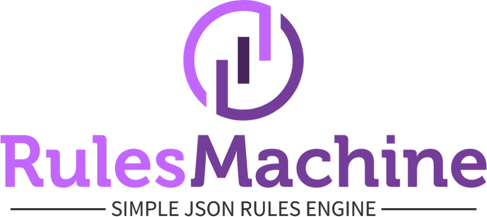

# Rules Machine

[](https://github.com/elite-libs/rules-machine/actions)
[](https://www.npmjs.com/package/@elite-libs/rules-machine)
[](https://github.com/elite-libs/rules-machine)
[](https://github.com/elite-libs/rules-machine/blob/main/LICENSE.md)



> **A fast, serializable rules engine for TypeScript & JavaScript** — move business logic where you need it.

---

**Table of Contents**

- [Quick Start](#quick-start)
- [What is Rules Machine?](#what-is-rules-machine)
- [Why Use a Rules Engine?](#why-use-a-rules-engine)
- [Installation](#installation)
- [Core Concepts](#core-concepts)
  - [App Logic vs Business Rules](#app-logic-vs-business-rules)
- [API Reference](#api-reference)
  - [ruleFactory](#rulefactory)
  - [Rule Types](#rule-types)
  - [Operators](#operators)
  - [Built-in Functions](#built-in-functions)
- [Examples](#examples)
- [Performance & Security](#performance--security)
- [Use Cases](#use-cases)
- [Contributing](#contributing)
- [License](#license)

## What is Rules Machine?

Rules Machine is a high-performance, general-purpose [rules engine](https://martinfowler.com/bliki/RulesEngine.html) for TypeScript and JavaScript. It executes business logic defined as JSON-serializable rules, making it perfect for:

- **Serverless & Edge** — Deploy rules to CloudFlare Workers, Lambda@Edge, or any V8 isolate
- **Shared Validation** — Use the same rules on client, server, and in transit
- **Dynamic Logic** — Store, sync, and update rules without redeploying code
- **Complex Decision Trees** — Organize pricing, discounts, approvals, and workflows

```bash
pnpm add @elite-libs/rules-machine
# or
npm install @elite-libs/rules-machine
# or
yarn add @elite-libs/rules-machine
```

## Quick Start

```ts
import { ruleFactory } from '@elite-libs/rules-machine';

const calculateDiscount = ruleFactory([
  { if: { and: ['price >= 25', 'price <= 50'] }, then: 'discount = 5' },
  { if: 'price > 50', then: 'discount = 10' },
  { return: 'discount' },
]);

calculateDiscount({ price: 40 }); // 5
calculateDiscount({ price: 60 }); // 10
```

## Why Use a Rules Engine?

Rules engines shine when you need to:

1. **Store & Sync Rules** — Keep rules in JSON/YAML, databases, or config services
2. **Manage Complexity** — Isolate business rules from core application logic
3. **Trace & Debug** — Get step-by-step execution traces for audits and debugging
4. **Enable Non-Devs** — Let product, QA, or business teams review rule logic

### Real-World Scenarios

- **E-commerce**: Tiered discounts, tax calculations, shipping rules
- **Finance**: Loan approvals, risk assessments, compliance checks
- **Healthcare**: Eligibility rules, coverage determinations, pricing tiers
- **SaaS**: Feature flags, usage limits, subscription tiers

## Core Concepts

### App Logic vs Business Rules

| **App Logic**               | **Business Rules**            |
| --------------------------- | ----------------------------- |
| Changes infrequently        | Changes frequently            |
| Core application behavior   | Business policies & decisions |
| _"Validate cart total > 0"_ | _"Premium users get 25% off"_ |
| _"One discount per order"_  | _"NY residents pay NY tax"_   |

**When to use Rules Machine:**

- Rules change based on business needs (pricing, discounts, approvals)
- You need to store or sync rules across environments
- Audit trails and execution traces are required
- Non-technical stakeholders need to review logic

## API Reference

### `ruleFactory`

Creates a rule executor from JSON-serializable rules.

```ts
import { ruleFactory } from '@elite-libs/rules-machine';

const engine = ruleFactory(rules, options?);
const result = engine(input);
```

**Options:**

| Option              | Type      | Default | Description                   |
| ------------------- | --------- | ------- | ----------------------------- |
| `trace`             | `boolean` | `false` | Enable execution tracing      |
| `ignoreMissingKeys` | `boolean` | `true`  | Skip undefined keys vs. throw |

**Returns:** Function that accepts input object and returns result (or trace object if enabled).

### Rule Types

#### Conditional: `if/then/else`

```ts
ruleFactory([
  { if: 'score > 90', then: 'grade = "A"' },
  { if: 'score > 80', then: 'grade = "B"' },
  { else: 'grade = "C"' },
]);
```

#### Logical: `and` / `or`

```ts
// Object form (short-circuits)
{ if: { and: ['age >= 18', 'age <= 65'] }, then: 'eligible = true' }

// Inline form
{ if: 'age >= 18 AND age <= 65', then: 'eligible = true' }
```

#### Array Operations: `map`, `filter`, `every`, `some`, `find`

```ts
// Map: double each item
ruleFactory([
  {
    map: 'numbers',
    run: '$item * 2',
    set: 'doubled',
  },
]);

// Filter: keep only multiples of 3
ruleFactory([
  {
    filter: 'numbers',
    run: '$item % 3 == 0',
    set: 'results',
  },
  { return: 'results' },
]);

// Every: check if all items match
ruleFactory([
  {
    every: 'numbers',
    run: '$item % 3 == 0',
    set: 'allMatch',
  },
  { return: 'allMatch' },
]);
```

Special variables available in array rules: `$item`, `$index`, `$array`.

#### Return: `return`

Ends execution and returns a value.

```ts
ruleFactory([{ if: 'valid', then: 'result = "ok"' }, { return: 'result' }]);
```

#### Error Handling: `try/catch`

```ts
ruleFactory([
  { try: 'riskyOperation()', catch: 'status = "failed"' },
  { return: 'status' },
]);
```

### Operators

**Comparison:** `=`, `==`, `!=`, `<>`, `<`, `<=`, `>`, `>=`, `~=`

**Arithmetic:** `+`, `-`, `*`, `/`, `%`, `^`

**Logical:** `AND`, `OR` (note: inline forms don't short-circuit; object forms do)

### Built-in Functions

Rules Machine includes 80+ built-in functions:

#### Math

```
AVERAGE(), CEIL(), FLOOR(), ROUND(), TRUNC(), SUM()
ADD(), SUB(), DIV(), MUL(), NEG(), MOD(), GCD()
ABS(), SQRT(), CUBEROOT(), SIGN()
ISPRIME(), ISNAN(), NOT()
```

#### Array

```
LENGTH(), SLICE(), SORT(), REVERSE()
MIN(), MAX(), HEAD(), LAST(), TAIL()
TAKE(), DROP(), TAKEWHILE(), DROPWHILE()
FILTER(), MAP(), REDUCE()
CONCAT(), CONS(), JOIN(), RANGE()
CONTAINS(), INDEX()
```

#### Object

```
DICT(), KEYS(), VALUES(), UNZIP(), UNZIPDICT()
CONTAINS(), COUNT_KEYS(), OMIT()
ZIP()
```

#### String

```
LOWER(), UPPER(), SPLIT(), CHAR(), CODE()
STRING_CONTAINS(), STRING_STARTS_WITH(), STRING_ENDS_WITH()
BIN2DEC(), DEC2BIN(), DEC2HEX(), HEX2DEC()
DEC2STR(), STR2DEC(), CHARARRAY()
```

#### Utility

```
IF(), GET(), FILTER_VALUES(), REMOVE_VALUES()
THROW()
```

Trigonometry & advanced math: `SIN()`, `COS()`, `TAN()`, `ASIN()`, `ACOS()`, `ATAN()`, `EXP()`, `LN()`, `LOG()`, `LOG2()`, `DEGREES()`, `RADIANS()`, and more.

## Examples

### Discount Tiers

```json
[
  { "if": { "and": ["price >= 25", "price <= 50"] }, "then": "discount = 5" },
  { "if": "price > 50", "then": "discount = 10" },
  { "return": "discount" }
]
```

### User Eligibility

```json
[
  { "if": "user.plan == \"premium\"", "then": "discount = 15" },
  { "if": "user.employee == true", "then": "discount = 15" },
  { "return": "discount" }
]
```

### Complex Conditions with State

```json
[
  {
    "if": "price <= 100",
    "then": ["discount = 5", "user.discountApplied = true"]
  },
  {
    "if": { "and": ["price >= 90", "user.discountApplied != true"] },
    "then": "discount = 20"
  },
  { "return": "discount" }
]
```

### Array Processing

```ts
const processOrders = ruleFactory([
  {
    filter: 'orders',
    run: '$item.total > 100',
    set: 'largeOrders',
  },
  {
    map: 'largeOrders',
    run: '$item.total * 0.9',
    set: 'discountedTotals',
  },
  {
    return: 'discountedTotals',
  },
]);

processOrders({ orders: [{ total: 50 }, { total: 150 }, { total: 200 }] });
// [135, 180]
```

### With Execution Trace

```ts
const engine = ruleFactory(rules, { trace: true });
const result = engine({ price: 45 });

console.log(result.trace);
// [
//   { operation: 'begin', startTime: ... },
//   { operation: 'if', rule: 'price >= 25 AND price <= 50', result: true },
//   { operation: 'evalRule', rule: 'discount = 5', value: 5 },
//   { operation: 'complete', runTime: 0.42 }
// ]
```

## Performance & Security

### Security

- **No `eval()`** — Uses safe expression parsing via [`expressionparser`](https://www.npmjs.com/package/expressionparser)
- **Protected keys** — Blocks dangerous keys: `__proto__`, `constructor`, `prototype`, etc.
- **Reserved fields** — Prevents use of `$item`, `$index`, `$array` in input

### Performance

- Optimized for high-throughput scenarios
- Minimal overhead vs. native JavaScript
- Suitable for edge computing and serverless environments

## Use Cases

| Industry       | Use Case                                                           |
| -------------- | ------------------------------------------------------------------ |
| **E-commerce** | Dynamic pricing, discount stacks, tax calculations, shipping rules |
| **Finance**    | Loan approvals, risk scoring, compliance checks, fraud detection   |
| **Healthcare** | Eligibility verification, coverage rules, claim adjudication       |
| **SaaS**       | Feature flags, usage limits, tier upgrades, billing logic          |
| **Gaming**     | Achievement unlocks, loot tables, match-making rules               |

## Documentation

- **[Why Use a Rules Engine?](./docs/why.md)** — When and why to use Rules Machine
- **[Getting Started Guide](./docs/guide.md)** — Step-by-step tutorial
- **[Examples](./docs/examples.md)** — Real-world patterns and use cases

## Contributing

1. Fork the repo
2. Create a feature branch: `git checkout -b feature/my-feature`
3. Commit changes: `git commit -am 'Add new feature'`
4. Push: `git push origin feature/my-feature`
5. Submit a PR

### Development

```bash
pnpm install
pnpm build
pnpm test
pnpm test:coverage
```

## License

BSD-3-Clause — See [LICENSE](LICENSE.md) for details.

---

**Related Projects:**

- [JSON Rules Engine](https://www.npmjs.com/package/json-rules-engine)
- [Martin Fowler: Rules Engine](https://martinfowler.com/bliki/RulesEngine.html)
